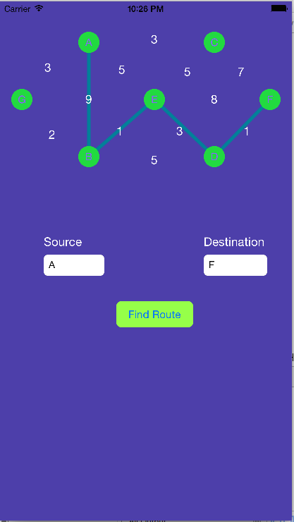

# Implementation of Dijkstra's Algorithm 
by Md. Muzahidul Islam <mmsaddam@gmail.com>

##Language
Objective-C

##Tools
Xcode 6.3, Cocoa Touch

#Introduction
Implementation of shortestpath Dijkstra's graph algorithm using Objective-C.Creating Graph and travel among the node within shortest distance. Demo Graph and travese among two node have done.

#Future Development
More complex graph implementation and UI improvement